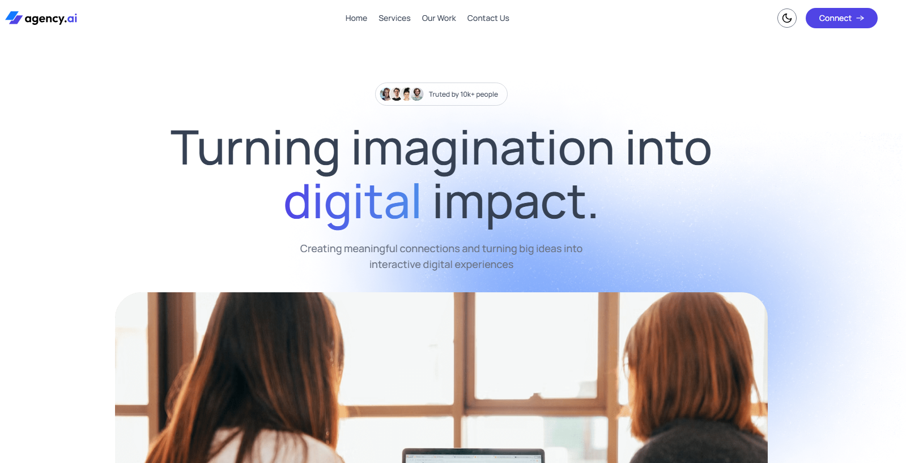
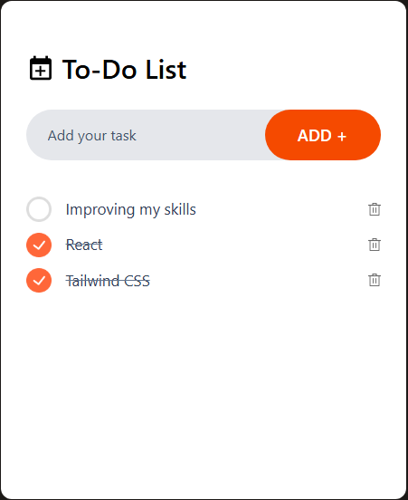

# Ryller Fonseca

**`FullStack Developer`**

Sou estudante de Engenharia da Computação na Universidade Federal de Sergipe. Tenho foco no desenvolvimento web, especialmente com JavaScript, TypeScript, React e Tailwind CSS. Gosto de criar soluções modernas, práticas e bem estruturadas, sempre buscando boas práticas de código e aprendizado contínuo

---

###  Linguagens

### 🚀 Projetos

- [**Agency-ai**](https://agency-ai-six-lovat.vercel.app/#)                      
  Landing page completa para agência digital com design moderno, sistema de tema claro/escuro dinâmico, animações fluidas ao scroll e formulário de contato integrado. Desenvolvido com foco em experiência do usuário e performance.                
  Tecnologias: **React, Tailwind CSS, Motion (Framer Motion), React Hot Toast**                                                                                   
  Principais funcionalidades:                                                                                    
  🌓 Dark Mode: Alternância entre tema claro e escuro com persistência no localStorage                                                           
  ✨ Animações: Transições suaves com Motion (scroll animations, fade-in, stagger effects)                                     
  📧 Formulário de Contato: Integração com Web3Forms e notificações em tempo real via React Hot Toast

  

- [**ToDo App**](https://todo-app-self-ten-48.vercel.app)  
  Aplicativo de lista de tarefas desenvolvido com foco em usabilidade e design limpo.  
  Tecnologias: **React, Tailwind CSS**

    

### Social

)

