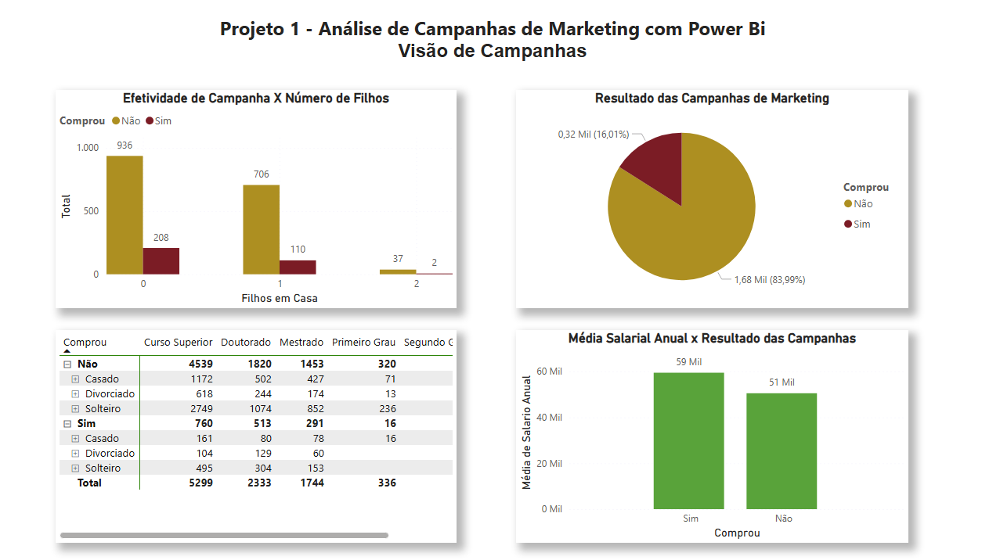
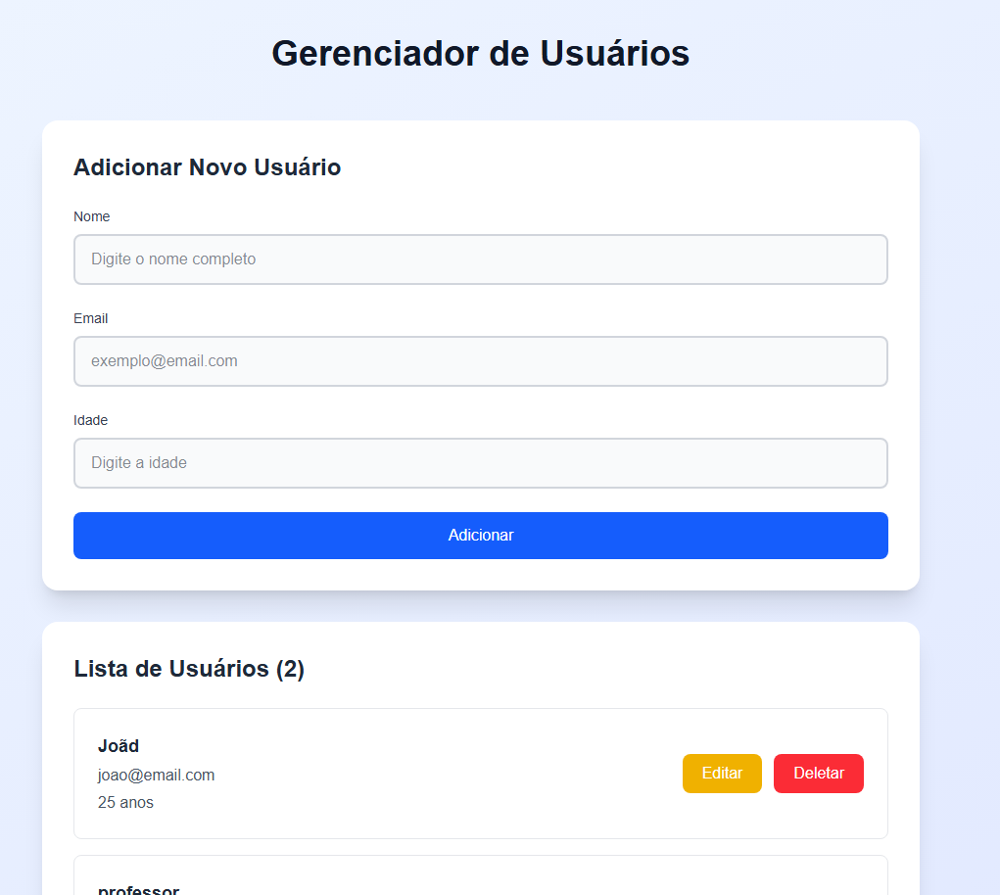
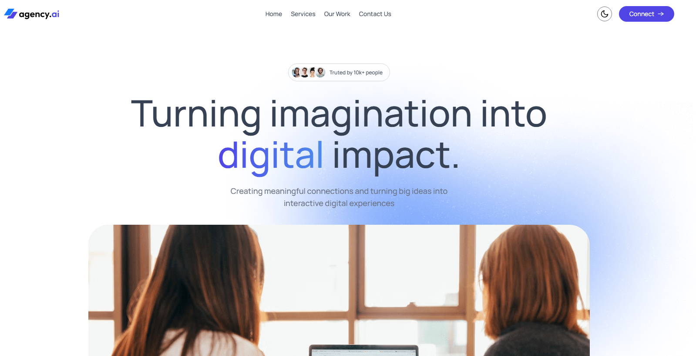
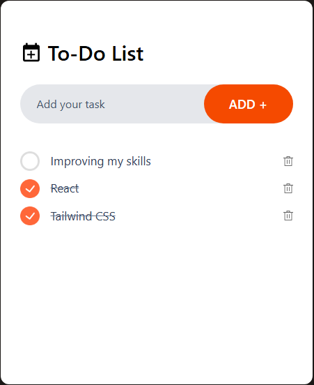

# Ryller Fonseca

**`Data Analyst | SQL • Python • ETL | Backend Developer`**

Sou estudante de Engenharia da Computação na Universidade Federal de Sergipe, com foco em análise de dados e desenvolvimento backend. Tenho interesse em transformar dados em insights por meio de análise exploratória, modelagem e visualização com Power BI.

Possuo experiência com manipulação de dados, criação de dashboards, definição de métricas e uso de DAX para análise de indicadores. Também desenvolvo aplicações backend utilizando Node.js e TypeScript, integrando APIs e banco de dados.

Busco oportunidades de estágio em **Análise de Dados** e **Desenvolvimento Backend**.

---

### 🧠 Data Skills
- Análise Exploratória de Dados (EDA)  
- SQL (consultas, joins, agregações)  
- Python para análise de dados (Pandas, NumPy)  
- ETL (Extração, Transformação e Carga de dados)  
- Modelagem de Dados  
- Criação de Dashboards  
- DAX (Data Analysis Expressions)  
- Definição de KPIs  

---

### 💻 Tech Stack

---

### 🚀 Projetos

- [**ETL Pipeline — Olist E-Commerce**](https://github.com/RyllerF/olist-ecommerce-etl)

  Pipeline ETL completo sobre o dataset público de e-commerce da Olist, processando ~100k pedidos reais do mercado brasileiro. Transforma 9 arquivos CSV brutos em um banco de dados analítico estruturado em camadas **Raw → Staging → Mart**.

  **Destaques do projeto:**
  - Arquitetura em camadas com separação clara de responsabilidades (Extract, Transform, Load, Validate)
  - Tabela fato `fct_sales` com métricas derivadas: tempo de entrega, flag de prazo, faturamento por item
  - Dimensões analíticas: clientes, produtos e vendedores com tradução de categorias PT→EN
  - 11 checks automáticos de qualidade de dados pós-carga (volumetria, nulos, integridade referencial)
  - Logging estruturado com rotação de arquivo para rastreabilidade em produção

  **Resultados:**  
  R$ 13,5 milhões processados · 92,1% de entregas no prazo · 112.650 itens em ~25s

  **Técnicas aplicadas:**  
  Modelagem dimensional (Star Schema), ETL, qualidade de dados, indexação SQL, idempotência de pipeline

  **Tecnologias:** Python, Pandas, SQLAlchemy, SQLite, Loguru

---

- [**Dashboard de Marketing (Power BI)**](https://github.com/RyllerF/dashboard-marketing)

  Análise de campanhas de marketing com foco em conversão, segmentação de clientes e comportamento de consumo. Projeto orientado à geração de insights para tomada de decisão.

  **Destaques do projeto:**
  - Análise de conversão de campanhas  
  - Segmentação por perfil demográfico (renda, estado civil, filhos)  
  - Relação entre renda e gasto  
  - Análise por canais de compra e países  

  **Técnicas aplicadas:**  
  EDA, modelagem de dados, criação de KPIs e dashboards interativos  

  **Tecnologias:** Power BI, DAX  

  

---

- [**CRUD de usuários**](https://crud-gerenciar-de-usuarios-git-main-ryllerfonsecas-projects.vercel.app)  

  Aplicação fullstack com integração a banco de dados, explorando operações CRUD e estruturação de APIs.

  **Tecnologias:**  
  Node.js, Express, Prisma ORM, MongoDB, React, Next.js, TypeScript  

  

---

- [**Agency-ai**](https://agency-ai-six-lovat.vercel.app/#)  

  Landing page moderna com foco em experiência do usuário e performance.

  **Tecnologias:** React, Tailwind CSS, Framer Motion  

  

---

- [**ToDo App**](https://todo-app-self-ten-48.vercel.app)  

  Aplicação de lista de tarefas com foco em usabilidade e interface.

  **Tecnologias:** React, Tailwind CSS  

  

---

### 📊 Diferenciais
- Capacidade de transformar dados em insights acionáveis  
- Experiência prática com dashboards e análise de métricas  
- Conhecimento em backend para integração com dados  
- Perfil analítico com foco em tomada de decisão  

---

### Social

  

