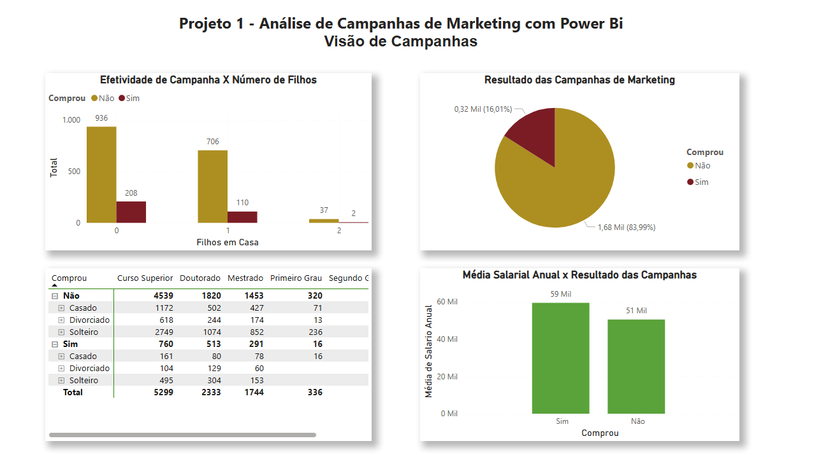
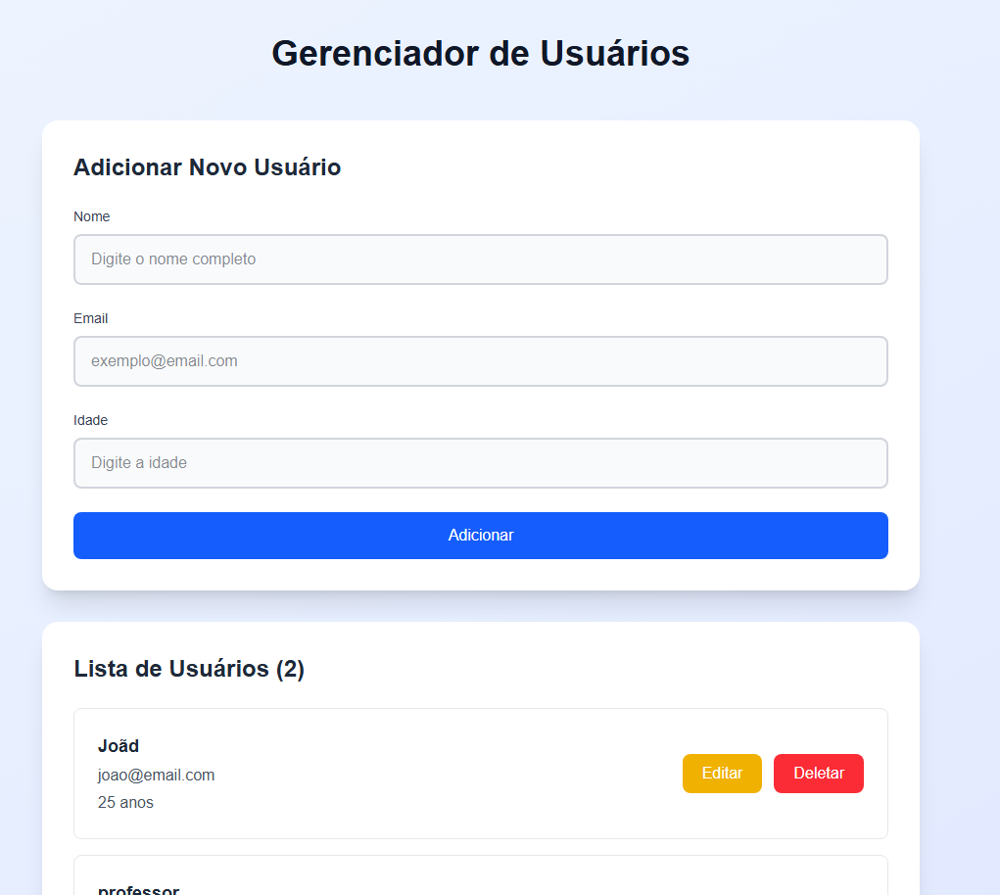

# Ryller Fonseca

**`Data Analyst | SQL • Python • ETL | Backend Developer`**

Sou estudante de Engenharia da Computação na Universidade Federal de Sergipe, com foco em análise de dados e desenvolvimento backend. Tenho interesse em transformar dados em insights por meio de análise exploratória, modelagem de dados, pipelines ETL e visualização com Power BI.

Possuo experiência com manipulação de dados, criação de dashboards, definição de métricas, consultas SQL e uso de DAX para análise de indicadores. Também desenvolvo aplicações backend utilizando Node.js e TypeScript, integrando APIs e bancos de dados.

Busco oportunidades de estágio em **Análise de Dados**, **Engenharia de Dados** e **Desenvolvimento Backend**.

---

### 🧠 Data Skills

- Análise Exploratória de Dados (EDA)
- SQL (consultas, joins, agregações)
- Python para análise de dados (Pandas, NumPy)
- ETL (Extração, Transformação e Carga de dados)
- Consumo de APIs para coleta de dados
- Modelagem de Dados
- PostgreSQL
- Criação de Dashboards
- DAX (Data Analysis Expressions)
- Definição de KPIs

---

### 💻 Tech Stack

---

### 🚀 Projetos

- [**ETL Pipeline — Olist E-Commerce**](https://github.com/RyllerF/olist-ecommerce-etl)

  Pipeline ETL completo sobre o dataset público de e-commerce da Olist, processando ~100k pedidos reais do mercado brasileiro. Transforma 9 arquivos CSV brutos em um banco de dados analítico estruturado em camadas **Raw → Staging → Mart**.

  **Destaques do projeto:**
  - Arquitetura em camadas com separação clara de responsabilidades (Extract, Transform, Load, Validate)
  - Tabela fato `fct_sales` com métricas derivadas: tempo de entrega, flag de prazo, faturamento por item
  - Dimensões analíticas: clientes, produtos e vendedores com tradução de categorias PT→EN
  - 11 checks automáticos de qualidade de dados pós-carga (volumetria, nulos, integridade referencial)
  - Logging estruturado com rotação de arquivo para rastreabilidade em produção

  **Resultados:**  
  R$ 13,5 milhões processados · 92,1% de entregas no prazo · 112.650 itens em ~25s

  **Técnicas aplicadas:**  
  Modelagem dimensional (Star Schema), ETL, qualidade de dados, indexação SQL, idempotência de pipeline

  **Tecnologias:** Python, Pandas, SQLAlchemy, SQLite, Loguru

  📊 [Ver análise exploratória completa (EDA)](https://github.com/RyllerF/olist-ecommerce-etl/blob/main/notebooks/eda_olist.ipynb)

---

- [**Valorant Analytics Pipeline**](https://github.com/RyllerF/valorant-pipeline)

  Pipeline ETL desenvolvido com dados públicos da API do Valorant, coletando informações de agentes, mapas e armas para estruturar uma base analítica em PostgreSQL e gerar consultas SQL orientadas à análise.

  **Destaques do projeto:**
  - Consumo de API pública com Python e `requests`
  - Salvamento dos dados brutos em JSON para rastreabilidade
  - Transformação dos dados com Pandas em tabelas tratadas
  - Modelagem inicial no PostgreSQL com tabelas para agentes, mapas e armas
  - Carga automatizada dos dados via SQLAlchemy
  - Consultas SQL para análise de agentes por função, mapas disponíveis e armas por categoria

  **Perguntas respondidas:**  
  Quantos agentes existem por função · Quais agentes são jogáveis · Quais mapas estão disponíveis · Quantas armas existem por categoria · Quais armas possuem custo no shop

  **Técnicas aplicadas:**  
  Consumo de API, ETL, modelagem relacional, PostgreSQL, SQL Analytics, organização de pipeline

  **Tecnologias:** Python, Requests, Pandas, SQLAlchemy, PostgreSQL, SQL, pgAdmin

---

- [**Dashboard de Marketing (Power BI)**](https://github.com/RyllerF/dashboard-marketing)

  Análise de campanhas de marketing com foco em conversão, segmentação de clientes e comportamento de consumo. Projeto orientado à geração de insights para tomada de decisão.

  **Destaques do projeto:**
  - Análise de conversão de campanhas
  - Segmentação por perfil demográfico (renda, estado civil, filhos)
  - Relação entre renda e gasto
  - Análise por canais de compra e países

  **Técnicas aplicadas:**  
  EDA, modelagem de dados, criação de KPIs e dashboards interativos

  **Tecnologias:** Power BI, DAX

  

---

- [**CRUD de usuários**](https://crud-gerenciar-de-usuarios-git-main-ryllerfonsecas-projects.vercel.app)

  Aplicação fullstack com integração a banco de dados, explorando operações CRUD e estruturação de APIs.

  **Tecnologias:**  
  Node.js, Express, Prisma ORM, MongoDB, React, Next.js, TypeScript

  

---

### 📊 Diferenciais

- Capacidade de transformar dados em insights acionáveis
- Experiência prática com pipelines ETL, dashboards e análise de métricas
- Conhecimento em SQL, modelagem de dados e integração com bancos relacionais
- Conhecimento em backend para consumo de APIs e integração com dados
- Perfil analítico com foco em tomada de decisão

---

### Social

  

